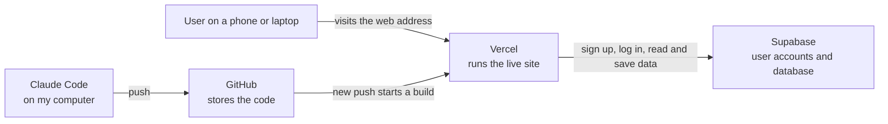
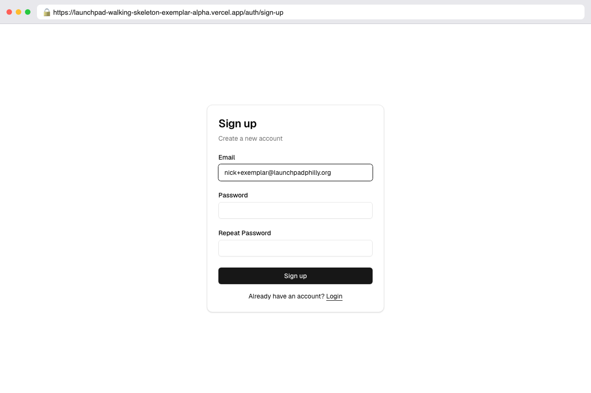
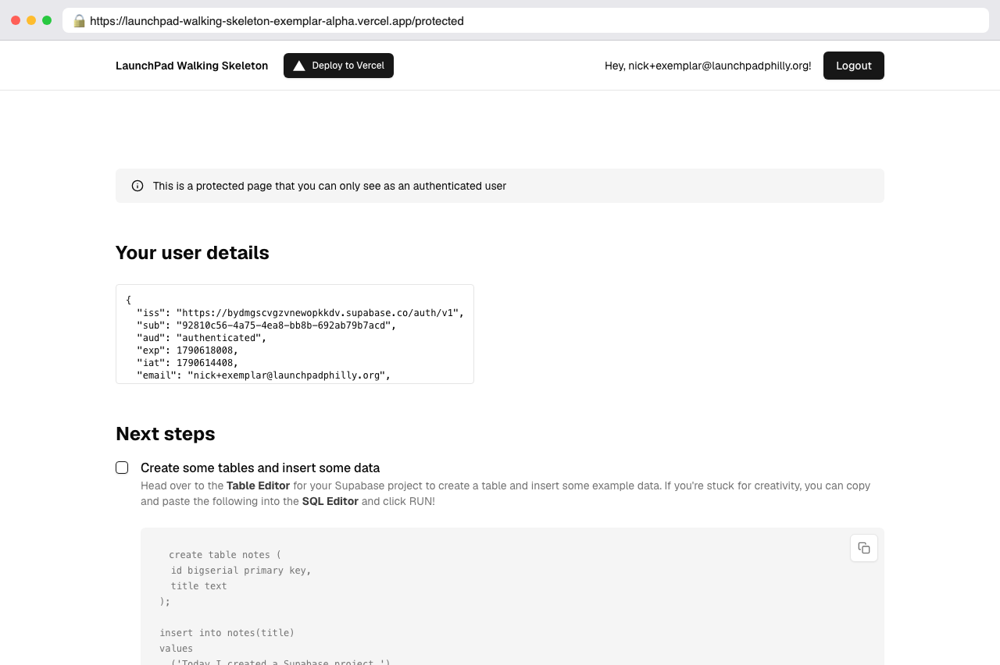
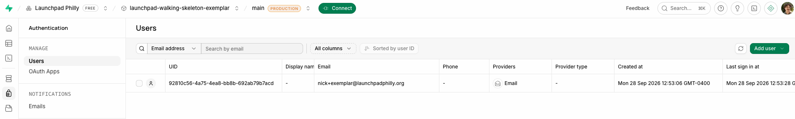
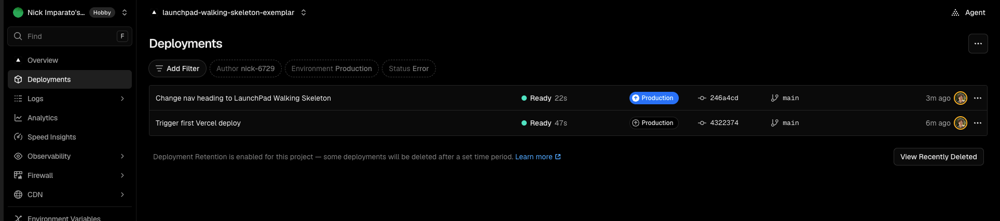
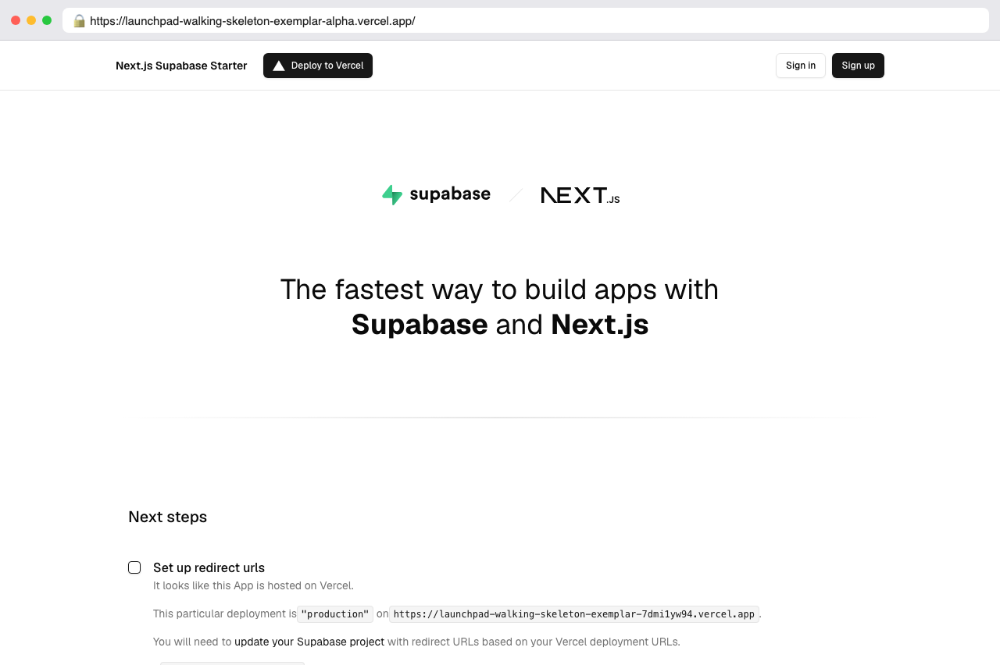
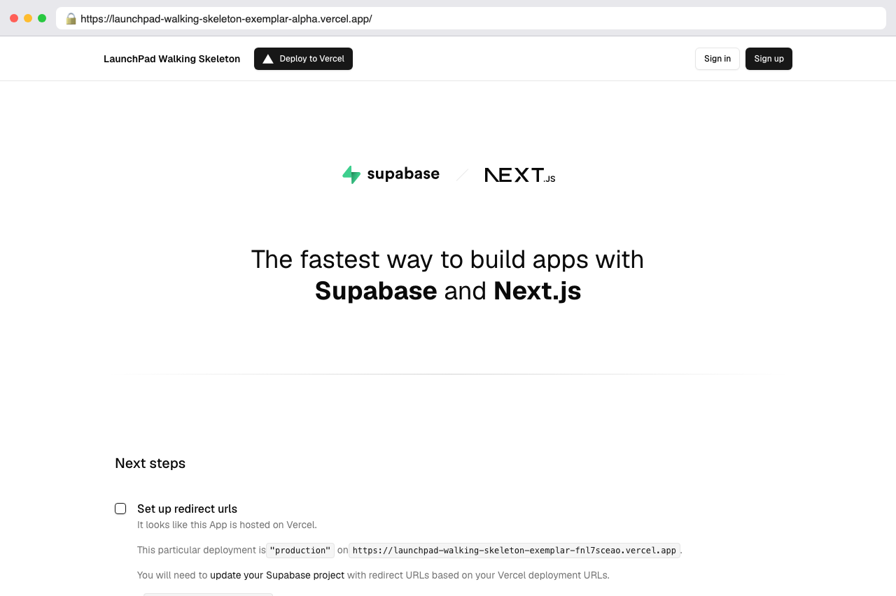

# LaunchPad Walking Skeleton (Exemplar)

This is an example of a finished Incentive 1 walking skeleton. It doesn't do anything our app is about yet. It proves every piece of the stack is connected: a live site where someone can sign up and log in.

**Live site:** https://YOUR-PROJECT.vercel.app

---

## 1. Where does the code live?

On GitHub, in this repo. It started as Vercel's Next.js and Supabase starter. Vercel copied the starter into my GitHub account when I deployed it. When I change the code with Claude Code, I push the changes here, and this repo is always the latest version.

## 2. Where does the data live, and what is stored there right now?

In Supabase, which is a database with user accounts built in. Right now the only thing stored is user accounts: each person's email address, when they signed up, and when they last logged in. Supabase stores passwords in a scrambled form, so nobody can read them, including me. No other data exists yet because our app doesn't have any features yet.

## 3. How does a change get from Claude Code to the live site?

1. I ask Claude Code to make a change in the code on my computer.
2. I check it on my own computer at `localhost:3000`.
3. I commit the change and push it to GitHub.
4. Vercel sees the new push to GitHub and starts a new build on its own.
5. After about a minute the build shows **Ready** in Vercel and the change is live at our web address.

## 4. What will we need to add to turn this into our team's app?

This exemplar uses Instagram as the example app. According to Britannica, Instagram launched in 2010 with "images (with the option to add filters), comments, and 'liking' features." To turn this skeleton into that first version, we'd need to add:

- A place to store photos (Supabase Storage) and an upload page
- Filters that change a photo before it's posted
- A feed page that shows everyone's photos, newest first
- A comments table in the database, linked to each photo and each user
- A likes table in the database, linked the same way
- A profile page for each user

Sign-up and login already work, so every one of these can know which user is doing it.

## 5. Diagram

---

## Screenshots

**Sign-up page on the live site, with the web address showing**

**The page I see after I log in**

**My new user in Supabase, under Authentication > Users**

**Vercel showing the deployment is Ready**

**Before my Claude Code change:** the top of the page said "Next.js Supabase Starter."

**After:** it says "LaunchPad Walking Skeleton."

